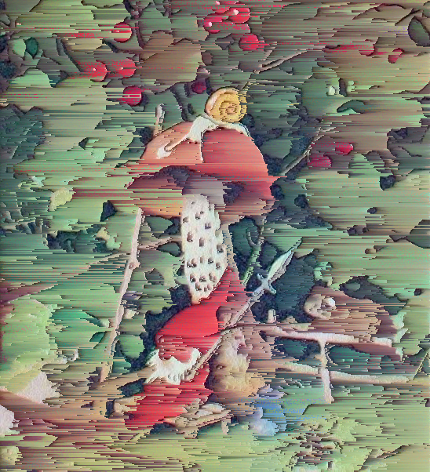
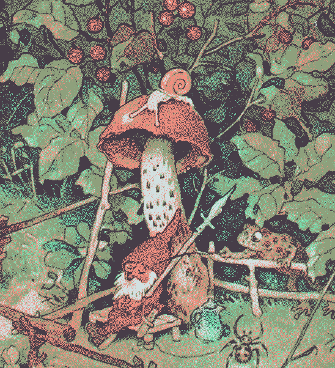

# pierogis

**image processing pipelines**

`pierogis` is a framework for image processing.
Ingredients that describe image processing functions can be assembled
into recipes and executed.

`pyrogis` is a python library and cli tool implementing this framework.

```bash
pip install pyrogis
pyrogis chef input.png "sort; quantize"
```


## features

- **Lazy Rendering** - Render a manipulation after constructing your pipeline
- **Extendable** - Easy to create custom manipulations
- **CLI** - Use the CLI to cook à la carte recipes, or provide a recipe in a document
- **Numpy or Rust backend** - Image processing functions use Numpy for (python relative) fast operations.
Some ingredients use compiled `Rust` for more speed.

## install

**install from a wheel with pip**

```sh
pip install pyrogis
```

Depends on `numpy` and `PIL`. PIL requires some external C libraries for handling image files.
You probably don't have to worry about this. If you do, try a `conda` installation.

To build from source (either the repository or the sdist), you will need to install the rust stable toolchain and `setuptools-rust`
```bash
curl --proto '=https' --tlsv1.2 -sSf https://sh.rustup.rs | sh
pip install setuptools-rust

python setup.py develop
# or 
pip install .
```

# usage

## cli

```bash
pyrogis {recipe} {path} [-o output.png] [...recipe options]
```

The options for output file name and path are used for each menu item subcommand (`sort`, `quantize`, etc.).
A directory can be used for the path, in which case the program will try to cook each file in the directory.
If an output is provided with a dir path, it should also be a directory.

|arg|description|default|valid|
|:----:|-----------|:-----:|:---:|
|`recipe`|menu item to cook|`required`|`sort`, `quantize`, `chef`, `threshold`|
|`path`|path to input media|`required`|`dir`, `file`|
|`-o`,`--output`|name of the output file|`cooked/{input filename}.png`|`str`|

### sort

*sort pixels along an axis*

```bash
pyrogis sort ./input.jpg -o output.png -l 50 -u 180 -t 1
```



|arg|description|default|valid|
|------|-----------|:-----:|:---:|
|`-l`, `--lower-threshold`|pixels with intensity *below* this value serve as sort boundaries|`64`|`0-255`|
|`-u`, `--upper-threshold`|pixels with intensity *above* this value serve as sort boundaries|`180`|`0-255`|
|`-t`, `--turns`|number of clockwise turns from sorting bottom to top|`0`|`0-3`|

### quantize

*quantize an image to a smaller set of colors*



```bash
pyrogis quantize ./input.jpg -o output.png -n 16 -r 3 -i 3
```

|arg|description|default|valid|
|:----:|-----------|:-----:|:---:|
|`-n`, `--palette_size`|number of colors in the palette to cluster for|`8`|`int`|
|`-r`, `--repeats`|number of times to repeat a temperature for DA|`1`|`int`|
|`-i`, `--iterations`|number of times to repeat an iteration of a coarseness level|`1`|`int`|
|`--initial_temp`|initial temp to use in DA for optimization|`1`|`float`|
|`--final_temp`|final temp to use in DA for optimization|`.001`|`float`|
|`-d`, `--dithering_level`|relative dithering level (use .5-1.5)|`.8`|`float`|

(See more documentation on [`rscolorq`](https://github.com/okaneco/rscolorq))

### chef

*parse text for a recipe*


txt files and quoted strings can describe a series of CLI recipes, piped from one to the next.

```bash
pyrogis chef ./input.jpg "sort -u 100; quantize" -o output.png
# or
pyrogis chef ./input.jpg recipe.txt -o output.png
```

*recipe.txt*
```text
sort -u 100; quantize
```

|arg|description|default|valid|
|:----:|-----------|:-----:|:---:|
|recipe|path to json or txt file to use as a recipe|`recipe.txt`|`str`|

## package

*"`pierogis` is the name of the framework;
`pyrogis` is the name of the python package and cli tool"
\- a wise man*

```python
from pyrogis import Pierogi, SpatialQuantize, Sort, Threshold, Dish, Recipe
```

A factory, called an `Ingredient`, has a `prep` method for receiving parameters,
and a `cook` method for operating on a numpy array to produce a programmatic output.

These two methods are usually called implicitly, `prep` on init and `cook` when rendering.
`prep` can be seen as parameterizing the manipulation while `cook` applies it (to an array).

### pierogi

`Pierogi` is one of the simplest `Ingredient` types. It just loads its reference image.

```python
pierogi = Pierogi(file="/Users/kyle/Desktop/image.jpg")
```

### quantize

`Quantize` is another `Ingredient`.
When cooked, it will process an incoming numpy array and return an array
where every pixel has been quantized to the closest color in the `palette`.

Note how it is less static than a `Pierogi`, almost *precooked*.
When a pierogi is cooked, the "manipulation" that it applies
is just loading the picture on top.
Quantize, like many other `Ingredient` types, depends on a meaningful input
to `cook` to produce a meaningful output.

There is also the SpatialQuantize variant which is used for the cli tool.

```python
palette = [
    [0, 0, 0],
    [127, 127, 127],
    [255, 255, 255]
]

quantize = Quantize(palette=palette)
quantized_pixels = quantize.cook(pierogi.pixels)
```

This should produce a pixel for pixel quantized version of the input array.

As you can see above, an `Ingredient` has a `pixels` member.
This is the internal numpy pixel array of that `Ingredient`
with shape `(width, height, 3)`.

Also consider how `quantize.pixels` doesn't really make sense compared to `pierogi.pixels`. This is related to the
relative "staticness" of `Pierogi`. More on that later.

Some other `Ingredient` types include: `Threshold`, `Flip`, and `Rotate`.

### recipe

A typical flow allows you to create a pipeline of `Ingredients`
that sequentially apply their `cook` method on to
the previous array of pixels.

A pipeline in `pierogis` is called a `Recipe`. It is an `Ingredient` itself.

```python
recipe = Recipe(ingredients=[pierogi, quantize])
recipe.cook()

recipe = Recipe(ingredients=[quantize])
recipe.cook(pierogi.pixels)
```

The two will produce the same result. But there's a better way.

### dish

*get to the point already \- a wiser man*

We could also use a `Dish` to serve this recipe. This is the recommended way to use `Recipe`.

```python
dish = Dish(recipe=recipe)
ingredient = dish.serve()
```

The recipe gets cooked sequentially.
The output ingredient can be used like a pierogi now, *precooked* (with `pixels` member set).
The `save` and `show` methods of `ingredient` can be used as well.

### seasoning

There is also a concept of seasonings 

## extending

If you want to create your own `Ingredient` type, you must subclass `Ingredient` and override the `cook` and `prep`
methods.

### prep

Use `prep` to parameterize your manipulation.

This means any settings, constants, or inputs that configure the new functionality. Think about the `palette` used with
quantization.

```python
def prep(self, brighten: int, scale: int, *args, **kwargs):
    self.brighten = brighten
    self.scale = scale
```

### cook

Use `cook` to perform the manipulation.

This is the function that you are applying to each pixel. More specifically, this function has
a `(width, height, 3)` `ndarray`
and should return a 3d array that is also size 3 in the last dimension.

```python
def cook(self, pixels: np.ndarray):
    return (self.pixels + self.brighten) / self.scale
```

This function increases the r, g, and b of every pixel by `self.brighten`
then divides them each by `self.scale`.

Numpy operations can be pretty fast if you can keep them vectorized. This means try to avoid looping over the columns
and rows of an array.

## acknowledgements

The original python [pixelsort](https://github.com/satyarth/pixelsort) package inspired this package. While the
underlying [algorithm](https://github.com/kimasendorf/ASDFPixelSort) of that package and of `sort` in this one is
supposed to be functionally the same, details of the implementation differ, and it makes up just part of this package.

The quantizing algorithm used in this package is implemented by [`rscolorq`](https://github.com/okaneco/rscolorq), which
is a port of [`scolorq`](http://people.eecs.berkeley.edu/~dcoetzee/downloads/scolorq/), itself an implementation
of Spatial Color Quantization.
